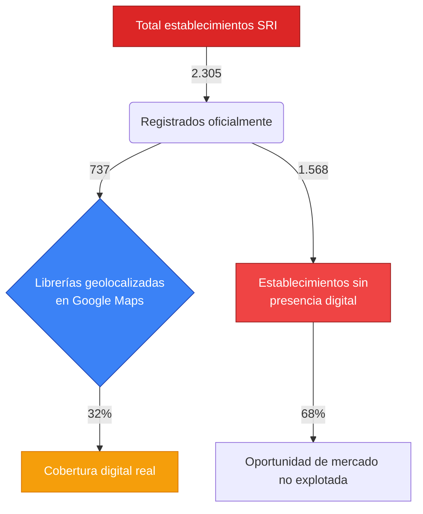
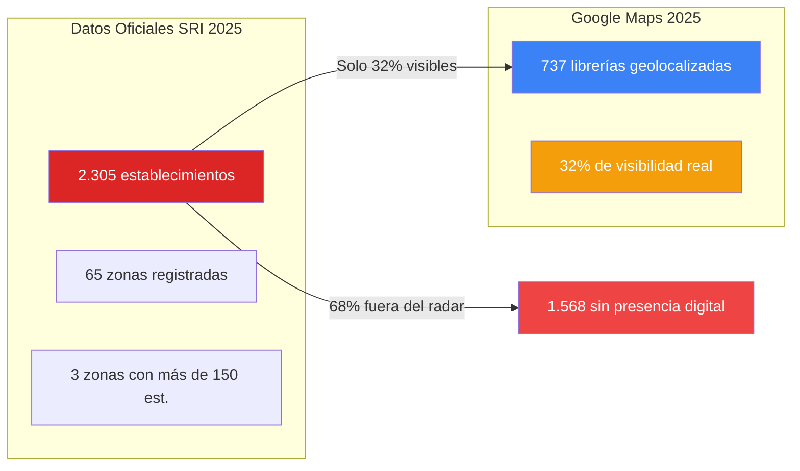

# **Libros Ecuador 2025**

Plataforma de comparación de precios de libros con mapa interactivo que integra datos reales de librerías y registros oficiales del SRI (2025).

---

## **Características principales**

- Comparación automática de precios entre librerías
- Mapa interactivo (Google Maps + SRI) con cobertura real del mercado
- Funciona **100 % offline** después de la primera carga
- Tablas con carga progresiva (10 en 10)
- Buscador avanzado con filtros por precio, librería y disponibilidad

---

## **Cobertura real del mercado (2025)**

El análisis combina datos oficiales del SRI y la geolocalización real en Google Maps para revelar la verdadera visibilidad digital del sector.

---

## **Tecnologías utilizadas**

| Tecnología                         | Función principal                                 |
| ---------------------------------- | ------------------------------------------------- |
| **HTML5 + CSS3 + JavaScript puro** | Interfaz, lógica de búsqueda y render dinámico    |
| **Leaflet.js**                     | Mapa interactivo con niveles de zoom y marcadores |
| **OpenStreetMap**                  | Capa base gratuita, rápida y ligera               |
| **LocalStorage**                   | Caché local para funcionar sin conexión           |
| **Font Awesome 6**                 | Iconografía moderna y liviana                     |
| **JSON locales**                   | Persistencia de todos los datos sin servidor      |

❗ **No requiere servidor, backend ni base de datos. Todo funciona localmente.**

---

## **Archivos de datos incluidos**

| Archivo                                               | Contenido                                    | Fuente                            |
| ----------------------------------------------------- | -------------------------------------------- | --------------------------------- |
| `librerias_procesadas.json`                           | Más de **28.000 precios reales de libros**   | Scraping propio (2025)            |
| `libros_imagenes.json`                                | Portadas de los libros más buscados          | Catálogos públicos                |
| `librerias_ecuador_pichincha_pastaza_intermedia.json` | 737 librerías geolocalizadas (datos exactos) | Google Maps + Places API          |
| `sri_pichincha_pastaza_coordenadas.json`              | 2.305 establecimientos oficiales SRI (2025)  | Servicio de Rentas Internas (SRI) |

---

## **Resultados del análisis (2025)**

| Métrica                         | Valor      |
| ------------------------------- | ---------- |
| Libros únicos detectados        | **510**    |
| Precio promedio                 | **$20.94** |
| Precio más bajo                 | **$2.49**  |
| Precio más alto                 | **$120**   |
| Librerías geolocalizadas (Maps) | **737**    |
| Zonas registradas por el SRI    | **65**     |
| Total de establecimientos SRI   | **2.305**  |
| Cobertura digital (Maps vs SRI) | **32 %**   |

➡️ _Solo 1 de cada 3 establecimientos oficiales aparece realmente en Google Maps._

---

## **Top 10 zonas con más establecimientos (SRI 2025)**

| #   | Zona / Parroquia         | Establecimientos |
| --- | ------------------------ | ---------------- |
| 1   | **Sangolquí**            | 218              |
| 2   | **Iñaquito**             | 193              |
| 3   | **San Juan**             | 172              |
| 4   | **La Magdalena**         | 127              |
| 5   | **Jipijapa**             | 111              |
| 6   | **San Rafael**           | 103              |
| 7   | **Cotocollao**           | 99               |
| 8   | **Calderón (Carapungo)** | 91               |
| 9   | **Tumbaco**              | 86               |
| 10  | **Conocoto**             | 80               |

---

## **Cómo usar la plataforma**

1. Descarga o clona el repositorio
2. Abre `index.html` en cualquier navegador moderno
3. La primera carga descarga todos los datos (1–5 min)
4. Desde la segunda visita, funciona **instantáneamente y sin internet**

---
