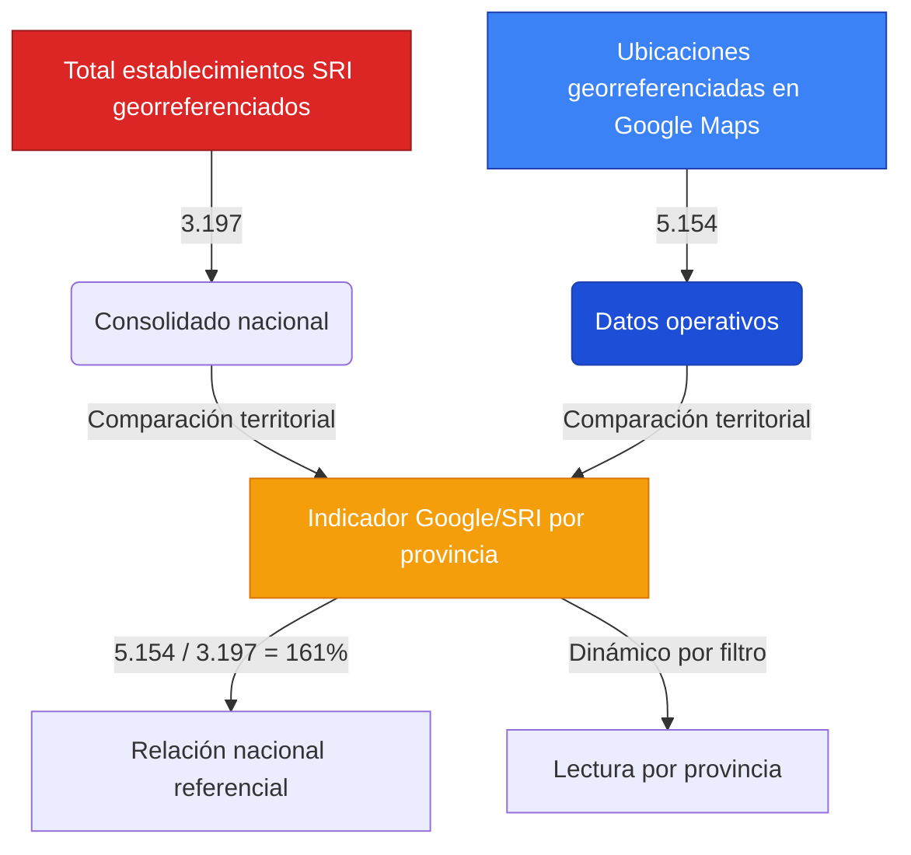
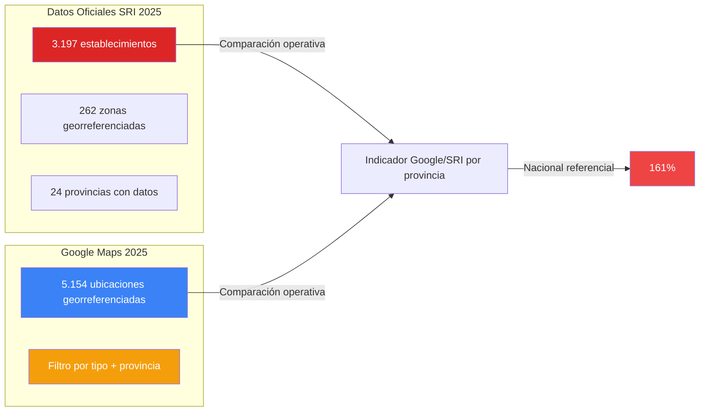

# **Libros Ecuador 2025**

Plataforma de comparación de precios de libros con mapa interactivo que integra datos reales de librerías y registros oficiales del SRI (2025).

---

## **Características principales**

- Comparación automática de precios entre librerías
- Mapa interactivo (Google Maps + SRI) con cobertura real del mercado
- Filtro del mapa por tipo: `Librería`, `Papelería`, `Bookstore` y `Otros`
- Funciona **100 % offline** después de la primera carga
- Tablas con carga progresiva (10 en 10)
- Buscador avanzado con filtros por precio, librería y disponibilidad

### Filtro por palabras clave en el mapa

- El tipo de establecimiento se clasifica usando `keyword_found`.
- Si `keyword_found` viene vacío, el sistema intenta inferir categoría desde el nombre y la dirección.
- Los registros que no calzan en las 3 categorías principales se muestran en `Otros` para no perder cobertura visual.

---

## **Cobertura real del mercado (2025)**

El análisis combina datos oficiales del SRI y la geolocalización real en Google Maps para mostrar el comportamiento territorial por provincia en tiempo real.

El panel del mapa muestra:
- `Librerías en Google Maps` (total de ubicaciones georreferenciadas en la provincia seleccionada)
- `Zonas SRI registradas`
- `Total establecimientos SRI` (total nacional consolidado)
- `Cobertura (Google vs SRI)` para la provincia activa
- Tarjeta dinámica `SRI en <provincia>` con resumen y zona líder





> Nota metodológica: este indicador puede superar 100% por diferencias de granularidad entre fuentes (zonas SRI agregadas vs múltiples puntos georreferenciados de Google para una misma zona/actividad).

---

## **Tecnologías utilizadas**

| Tecnología                         | Función principal                                 |
| ---------------------------------- | ------------------------------------------------- |
| **HTML5 + CSS3 + JavaScript puro** | Interfaz, lógica de búsqueda y render dinámico    |
| **Leaflet.js**                     | Mapa interactivo con niveles de zoom y marcadores |
| **OpenStreetMap**                  | Capa base gratuita, rápida y ligera               |
| **LocalStorage**                   | Caché local para funcionar sin conexión           |
| **Font Awesome 6**                 | Iconografía moderna y liviana                     |
| **JSON locales**                   | Persistencia de todos los datos sin servidor      |

❗ **No requiere servidor, backend ni base de datos. Todo funciona localmente.**

---

## **Estructura del proyecto**

```
Libros-Consolidado/
├── index.html          # Aplicación web
├── index.css           # Estilos
├── Readme.md
├── data/               # Todos los JSON (precios, ubicaciones, SRI, catálogo)
├── docs/               # Documentación adicional (README_heuristico.md)
└── scripts/            # Scripts de procesamiento (merge_librerias_con_sinteticos.py)
```

## **Archivos de datos incluidos** (en `data/`)

| Archivo                                               | Contenido                                    | Fuente                            |
| ----------------------------------------------------- | -------------------------------------------- | --------------------------------- |
| `librerias_procesadas.json`                           | Más de **28.000 precios reales de libros**   | Scraping propio (2025)            |
| `libros_imagenes.json`                                | Portadas de los libros más buscados          | Catálogos públicos                |
| `librerias_ecuador_pichincha_pastaza_intermedia.json` | Archivo base de ubicaciones geolocalizadas   | Google Maps + Places API          |
| `librerias_*.json` y `*_db.json`                      | Extensión provincial de ubicaciones Maps     | Google Maps + Places API          |
| `sri_pichincha_pastaza_coordenadas.json`              | Consolidado SRI de 24 provincias (262 zonas / 3.197 establecimientos georreferenciados) | Servicio de Rentas Internas (SRI) |

---

## **Resultados del análisis (2025)**

| Métrica                         | Valor      |
| ------------------------------- | ---------- |
| Libros únicos detectados        | **510**    |
| Precio promedio                 | **$20.94** |
| Precio más bajo                 | **$2.49**  |
| Precio más alto                 | **$120**   |
| Ubicaciones geolocalizadas (Maps) | **5.154** |
| Zonas registradas por el SRI    | **262**    |
| Total de establecimientos SRI georreferenciados   | **3.197**  |
| Relación nacional Maps/SRI (referencial) | **161 %**   |

➡️ _La comparación principal del dashboard es provincial y dinámica (según filtros de provincia y tipo)._

---

## **Top 10 zonas con más establecimientos (SRI 2025)**

| #   | Zona / Parroquia         | Establecimientos |
| --- | ------------------------ | ---------------- |
| 1   | **Santo Domingo de los Colorados** | 369    |
| 2   | **Nueva Loja**          | 279              |
| 3   | **Río Verde**           | 244              |
| 4   | **Bombolí**             | 189              |
| 5   | **Macas**               | 157              |
| 6   | **Abraham Calazacón**   | 146              |
| 7   | **Chiguilpe**           | 117              |
| 8   | **La Concordia**        | 93               |
| 9   | **Shushufindi**         | 84               |
| 10  | **Yantzaza**            | 60               |

---

## **Cómo usar la plataforma**

1. Descarga o clona el repositorio
2. Sirve la carpeta con un servidor web (por ejemplo `python -m http.server 8080` en la raíz del proyecto)
3. Abre `http://localhost:8080` en el navegador
4. La primera carga descarga todos los datos desde `data/`; desde la segunda visita funciona **instantáneamente** (caché local)

Para ejecutar el script de enriquecimiento de títulos desde la raíz del proyecto:

```bash
python scripts/merge_librerias_con_sinteticos.py
```

(Lee y escribe los JSON en la carpeta `data/`.)

---
